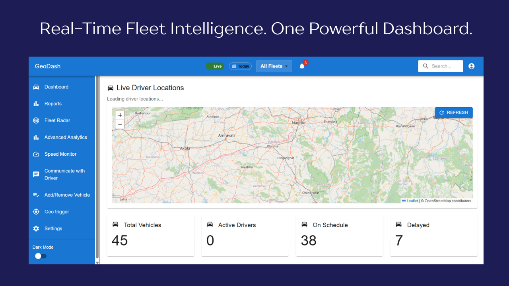
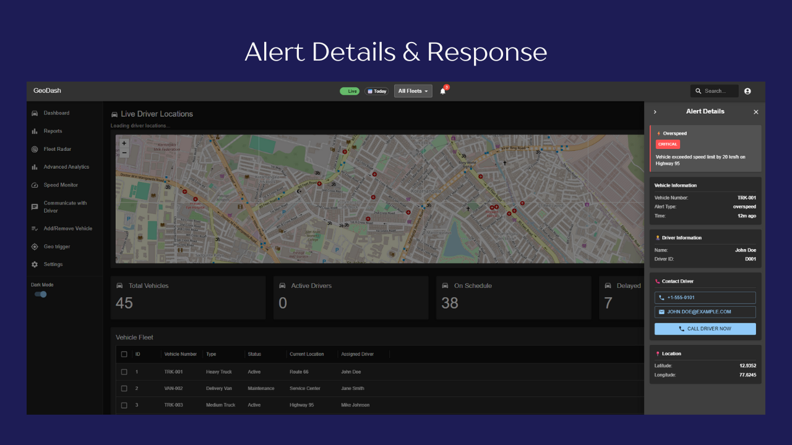
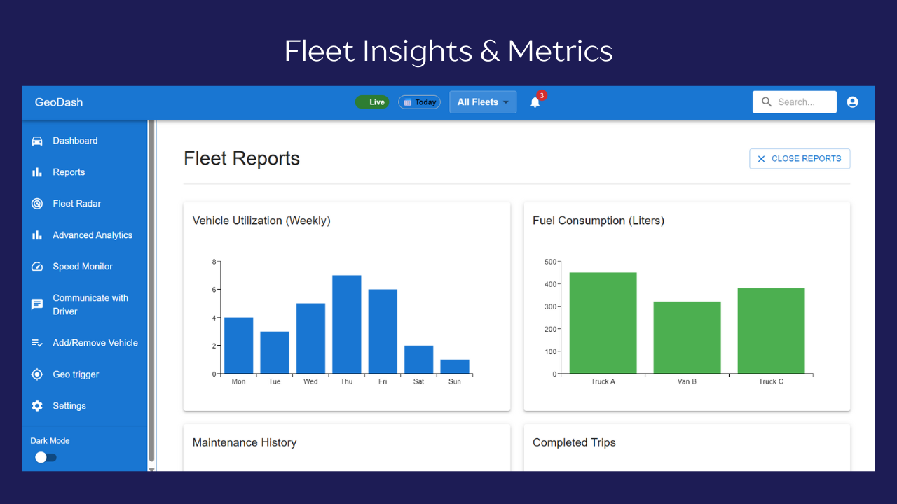
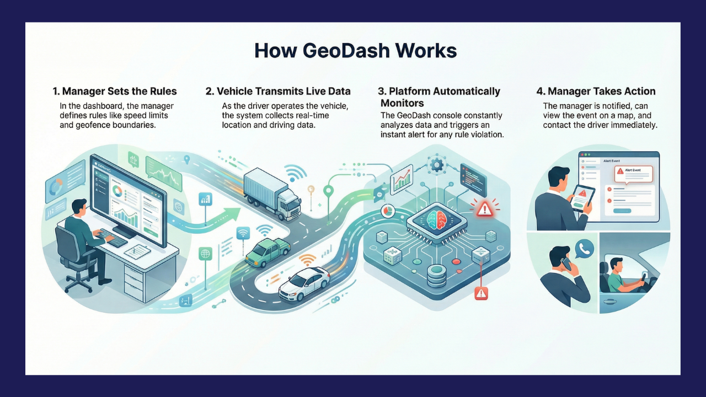
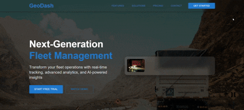

# GeoDash - Fleet Management System 

A modern, real-time fleet management and vehicle tracking solution for logistics companies.

## What is GeoDash?

GeoDash is an intelligent fleet management platform that helps logistics companies track vehicles in real-time, manage driver alerts, and optimize fleet operations. Built with modern web technologies, it provides instant visibility into your entire vehicle fleet with a beautiful, intuitive dashboard.

project status : paused

## Key Features

### Live Vehicle Tracking
- Real-time location updates for all vehicles on an interactive map
- Vehicle markers with driver information
- Automatic map zoom to show all vehicles
- Click-to-view driver details

### Intelligent Alert Management
- Automatic Alerts for:
  - Overspeed violations
  - Harsh braking detected
  - Harsh acceleration
  - Geofence breaches
  - Maintenance due
- Color-coded severity (Critical/Warning/Info)
- One-Click Driver Contact - Call or email drivers instantly
- Alert details with exact location coordinates
- Map automatically zooms to alert location

### Dashboard & Analytics
- Fleet overview with key metrics
  - Total vehicles
  - Active drivers
  - On-schedule vehicles
  - Delayed vehicles
- Vehicle fleet table with detailed information
- Real-time statistics

### Advanced Monitoring
- **Fleet Radar**: Visual radar-style fleet view
- **Speed Monitor**: Real-time speed tracking and violations
- **Geo-Trigger**: Create and manage geofence zones
- **Reports**: Fleet analytics and performance reports

### Professional UI
- Live status indicator (shows connection health)
- Quick filters (Today/All Time, Fleet selector)
- Dark & Light theme modes
- Fully responsive design (Desktop, Tablet, Mobile)
- Smooth animations and intuitive interactions

## Use Cases

### Logistics & Delivery Companies
Track multiple delivery vehicles in real-time, manage driver behavior, and optimize routes. Get instant alerts for overspeed, harsh braking, and geofence violations.

### Heavy Transport & Trucking
Monitor long-haul trucks, manage driver schedules, and track maintenance needs. Know exactly where your vehicles are and when they'll arrive.

### Taxi & Ride-Sharing Services
Real-time fleet visualization for dispatcher operations. Quick access to driver information and vehicle status.

### Field Service Management
Track service vehicles, monitor technician movements, and manage job assignments with real-time visibility.

### Retail & Distribution
Manage store delivery vehicles, track warehouse shipments, and optimize distribution routes.

### Public Transportation
Monitor fleet health, track vehicle locations, and manage driver performance metrics.

## Dashboard Overview

The main dashboard displays:
- **Interactive Map**: Shows all vehicle locations in real-time with vehicle icons
- **Top Status Bar**: Live | Today | All Fleets | Alerts (3)
- **Left Navigation**: Menu with all features and dark mode toggle
- **Statistics Cards**: Total Vehicles, Active Drivers, On Schedule, Delayed
- **Vehicle Table**: Detailed fleet information with sortable columns

## Alerts Panel

Right-side alert panel showing:
- List of all active alerts
- Each alert displays:
  - Vehicle number
  - Alert type (Overspeed, Harsh Brake, etc.)
  - Severity badge (Critical, Warning, Info)
  - Time elapsed (5m ago, 15m ago, etc.)
  - Click to expand for full details

## Alert Details View

When clicking an alert:
- Full alert information and description
- Vehicle details (Vehicle Number, Type, Timestamp)
- Driver information (Name, ID, Contact Details)
- One-Click Contact Options:
  - Phone button
  - Email button
  - "Call Driver Now" action button
- Location coordinates (Latitude, Longitude)
- Map automatically zooms to the alert location

## Status Indicators

Top Status Bar includes:
- **Live** - WebSocket connection status (pulsing when connected)
- **Time Filter** - Toggle between Today/All Time
- **Fleet Selector** - Choose All Fleets or specific fleet
- **Alerts Badge** - Shows count of active alerts

## Dark Mode Theme

Professional dark interface for night operations:
- Dark gray backgrounds
- Light blue accents
- High contrast text for readability
- Same functionality as light mode
- Easy on the eyes during 24/7 operations

## Responsive Design

Works perfectly on all devices:
- **Desktop**: Full sidebar, complete features
- **Tablet**: Optimized layout, touch-friendly
- **Mobile**: Hamburger menu, stacked layout, optimized buttons

## Core Benefits

- **Instant Visibility** - Know where every vehicle is in real-time
- **Reduce Incidents** - Get alerts on dangerous driving behaviors
- **Save Time** - Quick driver contact with one click
- **Improve Safety** - Monitor speed and harsh maneuvers
- **Professional UI** - Clean, modern interface
- **Mobile Ready** - Access from any device
- **Dark Mode** - Comfortable for night operations
- **Scalable** - Track 10 or 1000 vehicles

## Real-World Impact

**Example Scenario:**
1. Driver exceeds speed limit on highway
2. System instantly detects violation
3. Alert appears in dashboard (CRITICAL)
4. Manager clicks alert and map zooms to vehicle
5. Manager clicks "Call Driver Now" and phone app opens
6. Driver responds and corrects behavior

**Result:** Safety improved, incident prevented, driver corrected in seconds.

## Who Should Use This?

- **Fleet Managers** - Monitor and manage entire fleets
- **Operations Teams** - Track deliveries and dispatching
- **Driver Managers** - Monitor driver behavior and safety
- **Logistics Planners** - Optimize routes and schedules
- **Safety Officers** - Monitor incidents and violations

## Performance

- **Real-time Updates**: <100ms WebSocket latency
- **Map Performance**: Handles 1000+ vehicles smoothly
- **Data Refresh**: 5-second update intervals
- **Lightweight**: Optimized for fast loading

## Why Choose GeoDash?

- **Modern Technology** - Built with latest web frameworks
- **Beautiful Design** - Professional, intuitive interface
- **Lightning Fast** - Real-time updates with WebSocket
- **Fully Responsive** - Works perfectly on all devices
- **Feature Rich** - Everything you need for fleet management
- **24/7 Ready** - Dark mode for night operations
- **Smart Alerts** - Automatic incident detection
- **Quick Contact** - Call drivers with one click

## Built With

**Frontend:** React, TypeScript, Material-UI, Leaflet Maps, Socket.io  
**Backend:** Node.js, Express, MongoDB, WebSocket  
**Architecture:** Real-time WebSocket communication for instant updates

## Version Information

- **Version:** 1.0.0
- **Status:** on hold. no intent for deployment yet
- **Last Updated:** January 8, 2026

---

**Smart Fleet Management. Real-time Tracking. Professional Control.**

